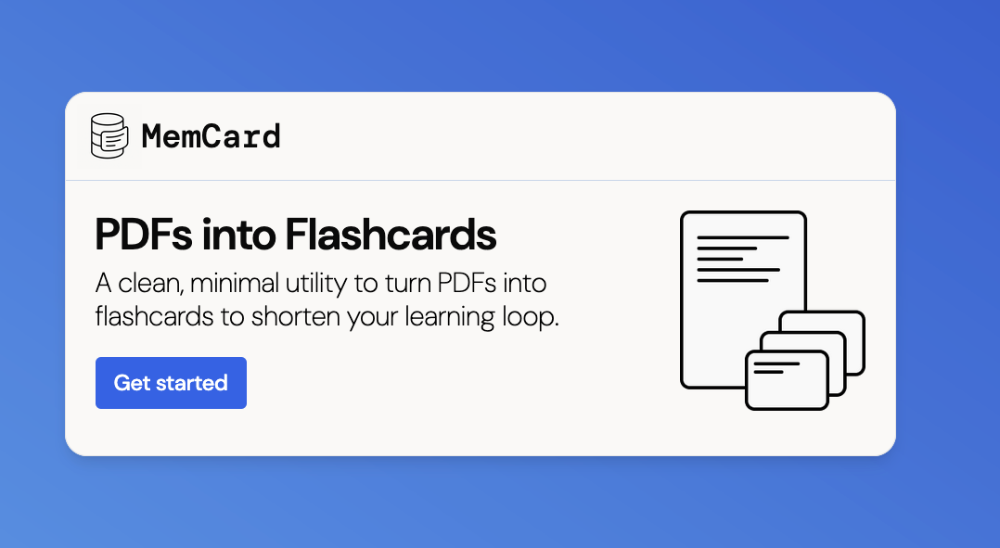
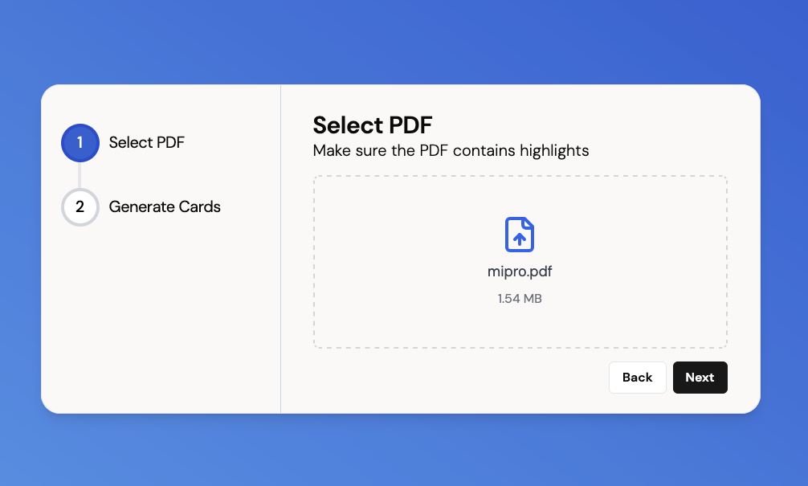
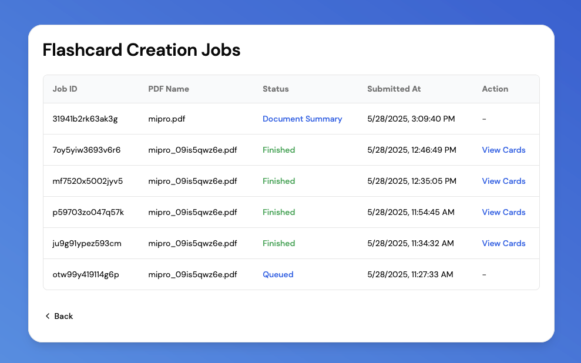
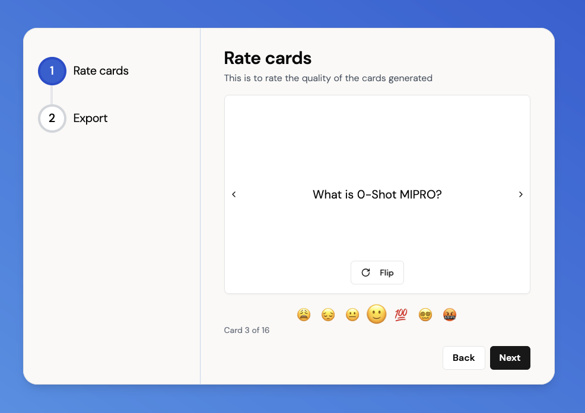
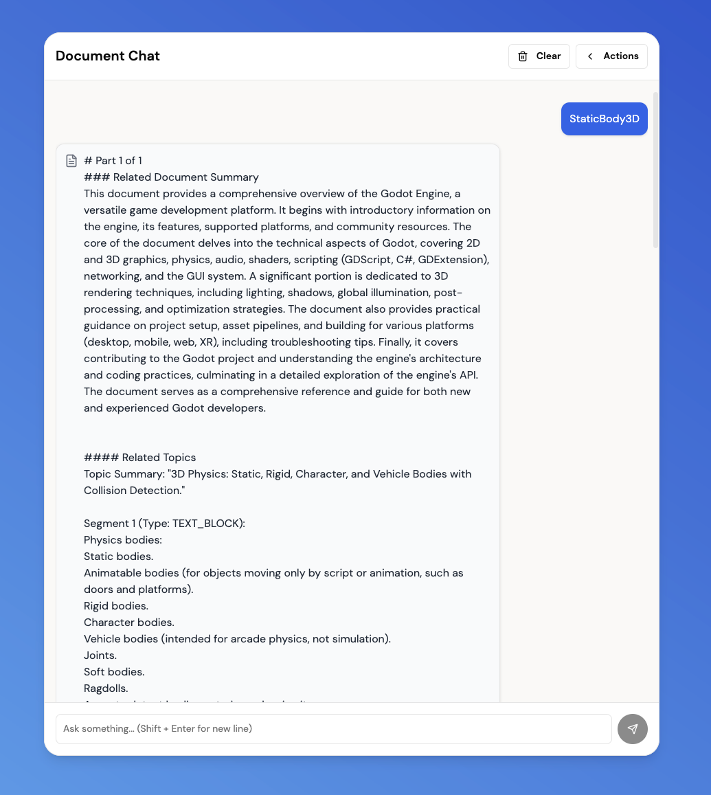

# MemCard
- Take a PDF and mark it with highlights. Upload that PDF to this tool and you get flashcards. Rate the flashcards and then export them to CSV file. All data is local and stays on your computer.
    - The ratings for the cards will be used to improve the quality of the generated flashcards. This feature will be added in future.
    - The generated cards likely won't be high quality but they can serve as a starting point.
    



## Local setup
* Make sure you have Docker installed. You can download it from [Docker's official website](https://www.docker.com/products/docker-desktop/).

**Instructions:**

1. **Clone Repo**
    ```bash
    git clone https://github.com/mithil957/memcard.git
    cd memcard
    ```

2. **Configure Environment Vars**
    *   Locate the `.env.example` file in the project (will be at the root)
    *   Create a copy of this file and name it `.env`
    *   Update the `GEMINI_API_KEY` with your api key from Gemini

3. **Start Service**
    ```bash
    # From the root directory `memcard`
    docker compose build
    docker compose up -d
    ```

4. **Accessing Application**

    Once all services are up and running (this might take a minute or two, especially on the first launch as databases initialize), you should be able to access:
    *   **MemCard Web UI:** `http://localhost:3000`
    *   **Pocketbase Admin UI:** `http://localhost:8090/_/` **(login as admin using variables in .env file -- INITIAL_ADMIN_EMAIL and INITIAL_ADMIN_PASSWORD)**
    *   **Temporal Web UI:** `http://localhost:8080`
    *   **Qdrant Web UI:** `http://localhost:6333/dashboard`


## Project Description
1.  The PDF is processed through multiple stages: highlight extraction, segmentation into logical blocks, chunking into smaller pieces, identification of topic boundaries, and generation of summaries for topics and the entire document.
2.  This structured data, along with vector embeddings of the content, is stored.
3.  When flashcard generation is requested, the system uses your highlights to retrieve the most relevant context from the processed document.
4.  This context is then fed into a prompt to generate flashcards.

* This frontend is built with Next.js. The data is managed using Pocketbase and Qdrant. The workflow is orchestrated using Temporal. Prompts are made using BAML and DSPy.
* If you want to modify the prompts used. Take a look at the `baml_src` folder in `temporal-project`. To play with these `.baml` files, you should follow the [BAML setup here](https://docs.boundaryml.com/guide/installation-language/python)  
* Possible future work
    - Develop flow to improve generated card quality using rated cards
    - Add natural language search feature
    - Ingest other forms like websites or videos
    - Integrate user notes as part of input when generating flashcards
    - Batch process PDFs

### Additional Screenshots




